# webspere-liberty-install
Guide on how to install Wesphere Liberty on Centos server


### Prerequsites

1. A remote server installed with Centos 7.x, VNC server
2. A Windows box with VNC viewer to connect to the server


### Get stated

- 1. Connect to the remote Centos server by VNC viewer
- 2. Download the IBM Installation Manger package

Click on the [link](https://download4.boulder.ibm.com/sdfdl/v2/sar/CM/RA/07hnt/0/Xa.2/Xb.jusyLTSp44S0MSxfbSR0jFZljMoCmsArctlgm3mZ38PsEPzElM8pGIWbvuk/Xc.CM/RA/07hnt/0/agent.installer.linux.gtk.x86_64_1.8.9000.20180313_1417.zip/Xd./Xf.LPR.D1VC/Xg.9721396/Xi.habanero/XY.habanero/XZ.wIAV7ge4CRRXyydTiF07Ro1fQw4/agent.installer.linux.gtk.x86_64_1.8.9000.20180313_1417.zip)
 
Install IBM Installation Manager. This is a tool which can be used to install many differrent IBM Websphere products

Check the folder 

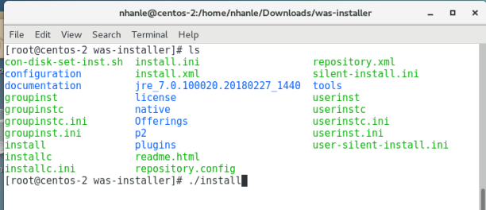

- 3. Install the "IBM Installation Manager"

```
	./install
```
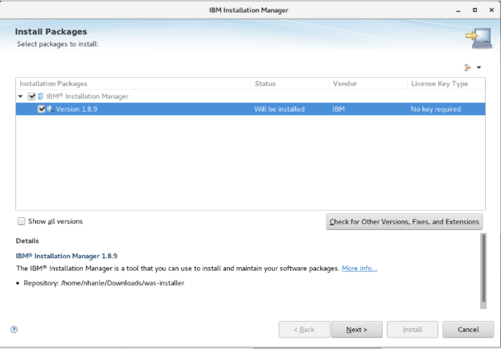

Accept the License Agreement and next

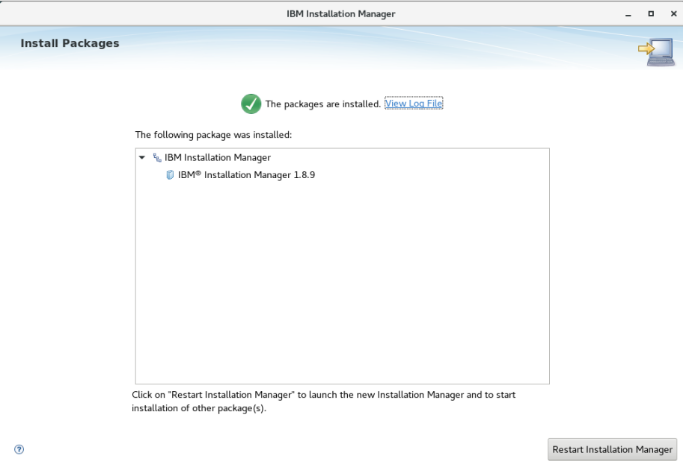

- 4. Install Websphere Server 8.5

+ Launch the IBM Installation Manager

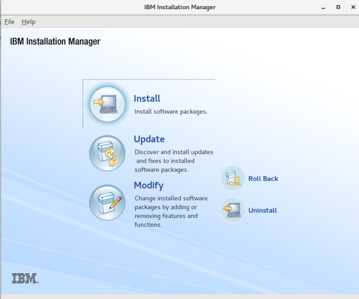
+ Click on the "Install" icon
+ Click on "Repositories" link

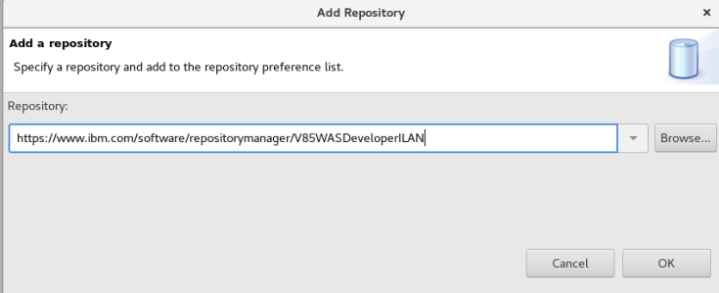

Wait for while so that the installer manager fetch all meta form the repositories

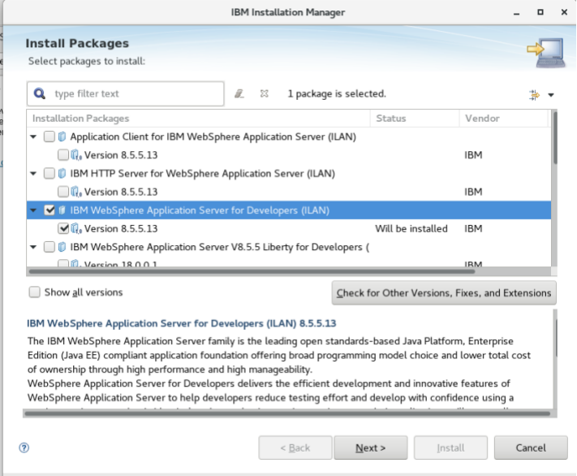

Select “IBM WebSphere Application Server for Developers (ILAN)” from the list
In the next screen, all recommended are selected/checked
Click “Next” and wait

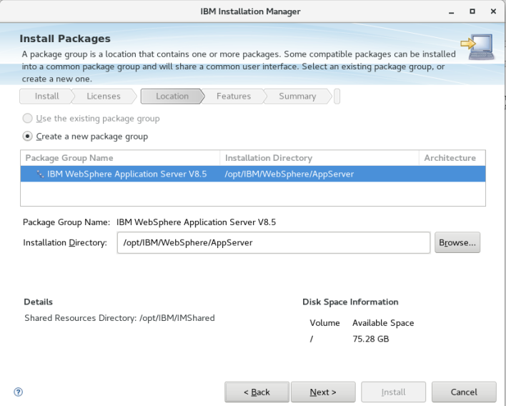

Select additional languages if needed

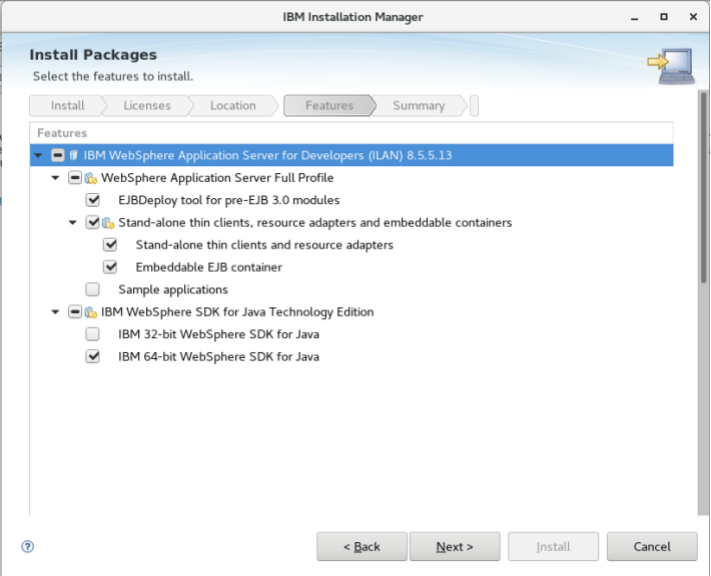

Click “Next” on the next screen

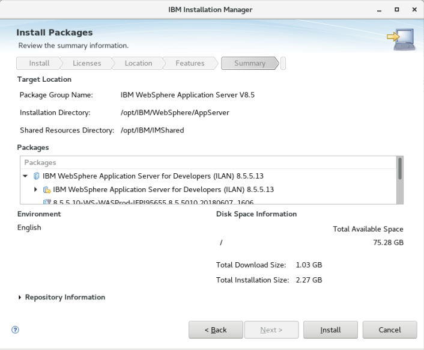

Wait for the installation manager to download the selected products package
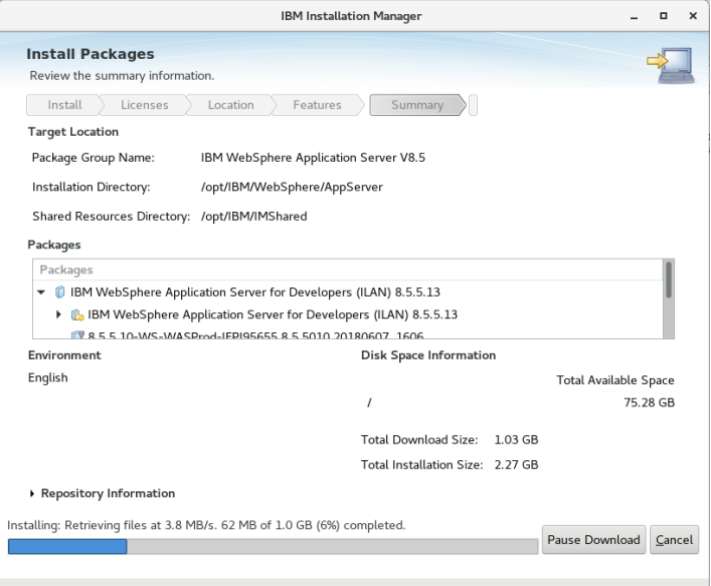

Take a cup of coffee and wait for the installer to download the files to install.

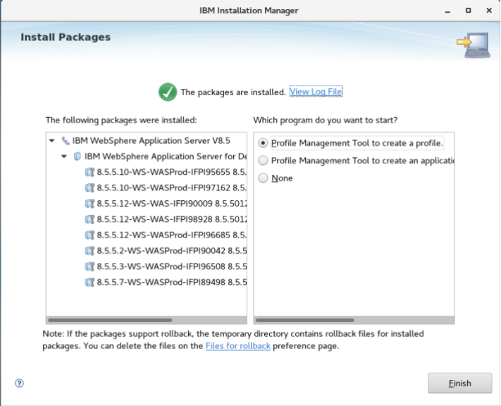

- 5. Create a new profile
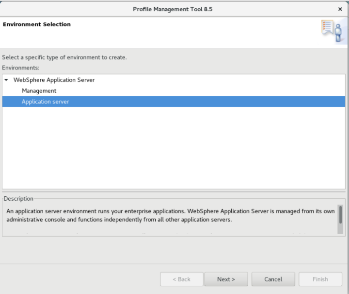
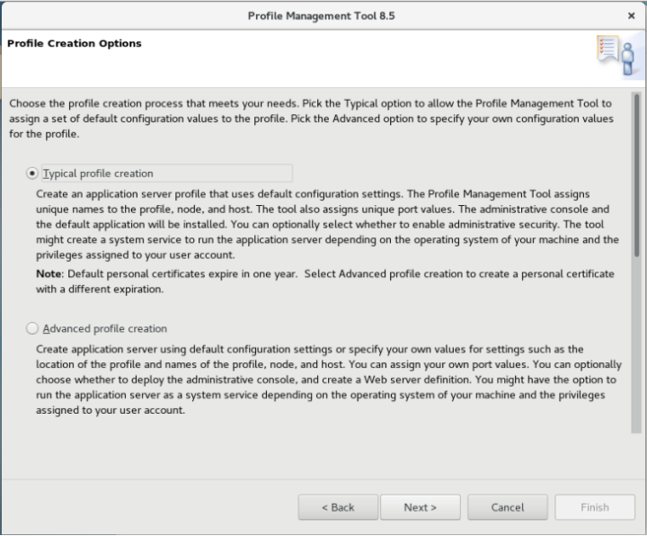
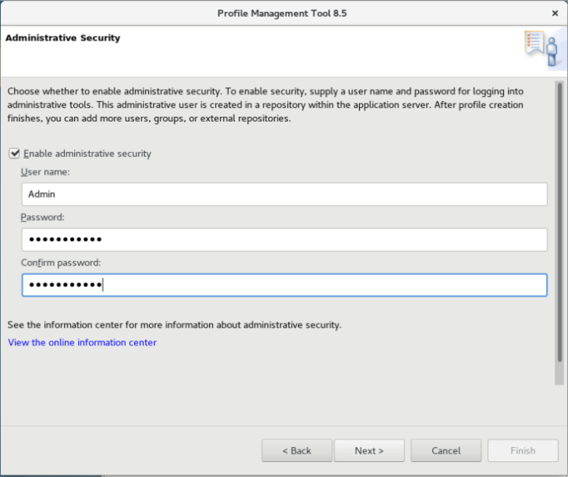
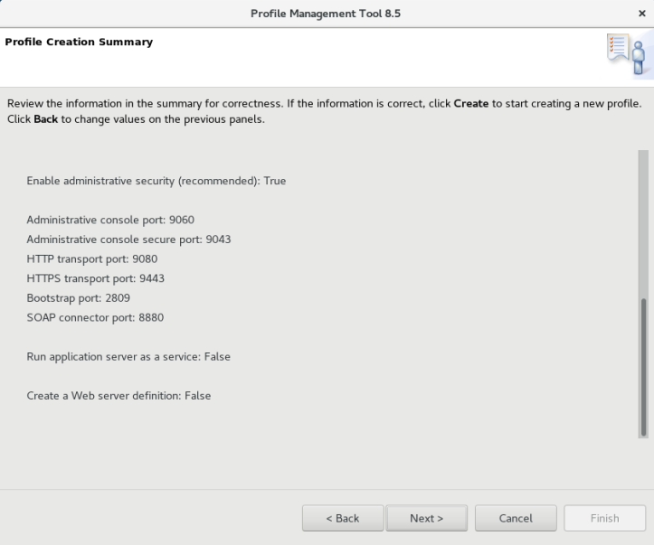

Wait for the profile to be created

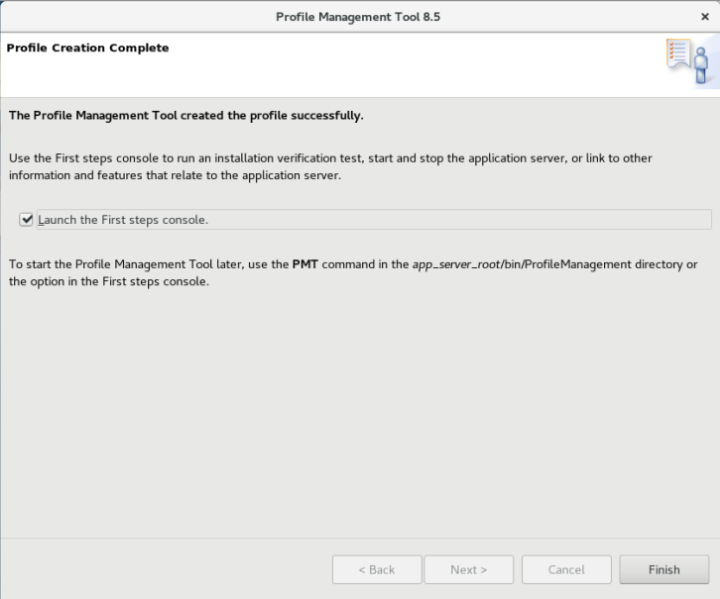


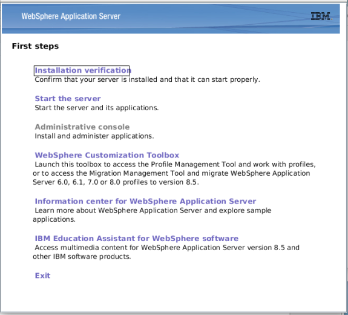

The profile has been created. Now check it: Click on “Start the server”

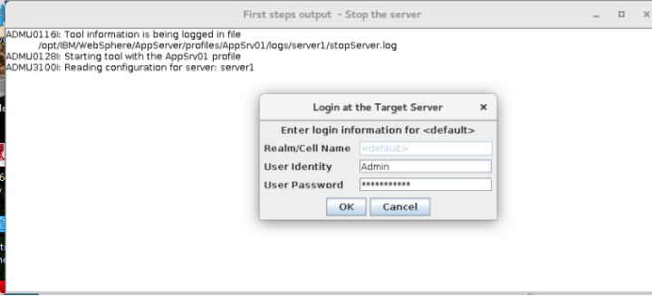
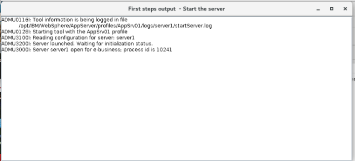


- 6. Verify the installation
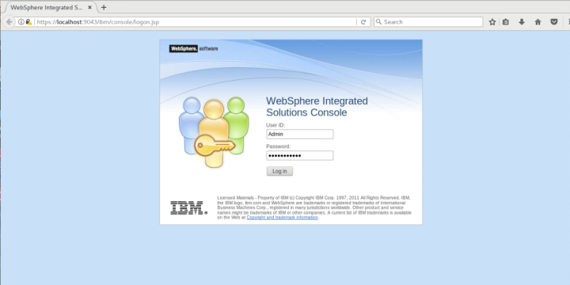
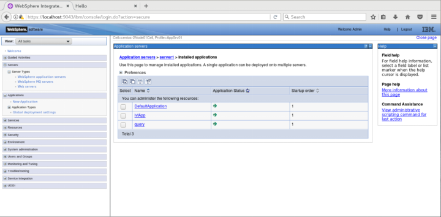

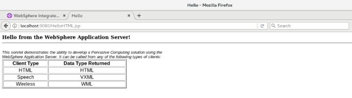

After the server restarted, use this command to start WebSphere again
```
/opt/IBM/WebSphere/AppServer/profiles/AppSrv01/bin/startServer.sh server1
```


